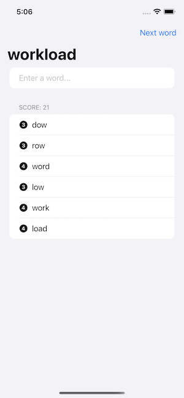

# WordScramble

This application was built following the SwiftUI tutorial of [Hacking with Swift](https://www.hackingwithswift.com/100/swiftui/), specifically

* [Day 29 – Project 5, part one](https://www.hackingwithswift.com/100/swiftui/29)
* [Day 30 – Project 5, part two](https://www.hackingwithswift.com/100/swiftui/30)
* [Day 31 – Project 5, part three](https://www.hackingwithswift.com/100/swiftui/31)

## Modifications
In the original tutorial, the text field used to enter words has to be selected at the start and after entering every word. 

This inconvenience can be fixed by adding the following:
``` swift
    private enum Field: Int, Hashable {
        case newWord
    }

    @FocusState private var focusedTextField: Field?
...

        TextField("Enter a word...", text: $newWord)
            .autocapitalization(.none)
            .focused($focusedTextField, equals: .newWord)
...

    func addNewWord() {
        ...
        focusedTextField = .newWord
    }
```



